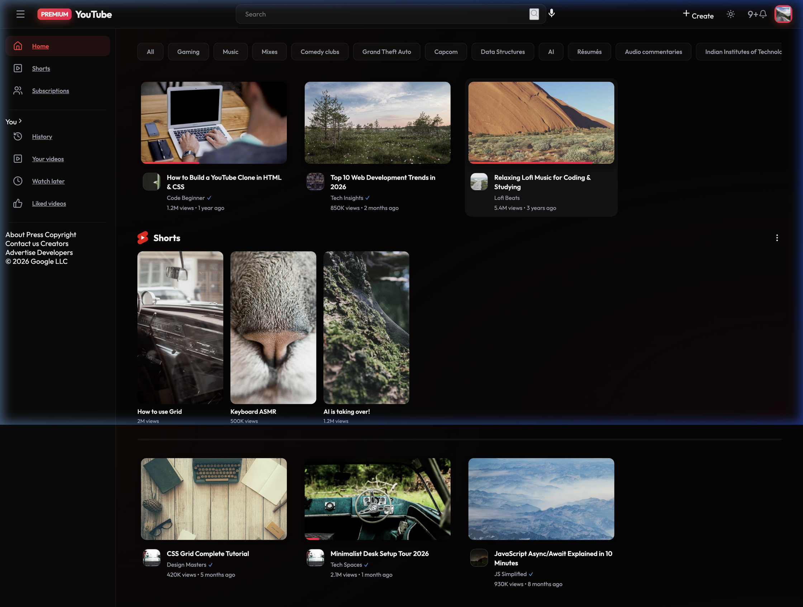

# YouTube Premium Clone

A high-performance, modern YouTube clone built with **React 18**, featuring a premium design system, glassmorphism aesthetics, and a fully interactive user experience.

[](https://youtube-clone-eight-pink-33.vercel.app/)



## ✨ Key Features

- **💎 Premium UI/UX**: Custom design system using the Outfit typeface, featuring glassmorphism effects and smooth micro-animations.
- **🌓 Adaptive Theme**: Seamless Dark and Light mode switching with automatic persistence in `localStorage`.
- **📺 Immersive Video Player**: Interactive video modal with a two-column layout, similar to the desktop YouTube experience.
- **📱 Immersive Shorts**: Dedicated vertical scrolling Shorts feed with scroll-snap and interactive action overlays.
- **⏭️ Up Next Content**: Integrated related videos sidebar within the player modal for continuous content discovery.
- **💬 Dynamic Interactions**: 
  - Real-time video search and category filtering.
  - Interactive Like/Dislike system with pop animations.
  - Functional mock subscription system.
  - Dynamically rendered comment sections.
- **📱 Fully Responsive**: Optimized for all screen sizes, from mobile devices to ultra-wide desktops.

## 🛠️ Tech Stack

- **Core**: React 18, React Router DOM, Vite
- **Styling**: Modern CSS3 (Custom Variables, Flexbox, CSS Grid)
- **Animations**: Framer Motion
- **Icons**: Lucide React
- **Tooling**: ESLint, Vercel (Deployment)

## 🚀 Getting Started

### Prerequisites

Ensure you have **Node.js** installed on your system.

### Installation

1. **Clone the repository**
   ```bash
   git clone https://github.com/sahilshingate01/Youtube_Clone.git
   cd Youtube_Clone
   ```

2. **Install dependencies**
   ```bash
   npm install
   ```

3. **Run the development server**
   ```bash
   npm run dev
   ```

4. **Build for production**
   ```bash
   npm run build
   ```

## 📁 Project Structure

```
Youtube_Clone/
├── src/
│   ├── components/  # Reusable UI components (Navbar, Sidebar, etc.)
│   ├── pages/       # Page-level components (Home, Shorts, etc.)
│   ├── data.js      # Mock video and comment data
│   ├── index.css    # Global styles and design system
│   ├── App.jsx      # Root component and Routing
│   └── main.jsx     # Application entry point
├── index.html       # HTML root container
└── package.json     # Project configuration
```

## 🔗 Live Deployment

The project is live and can be accessed at:
**[https://youtube-clone-eight-pink-33.vercel.app/](https://youtube-clone-eight-pink-33.vercel.app/)**

## 📜 License

This project is open-source and available under the [MIT License](LICENSE).
